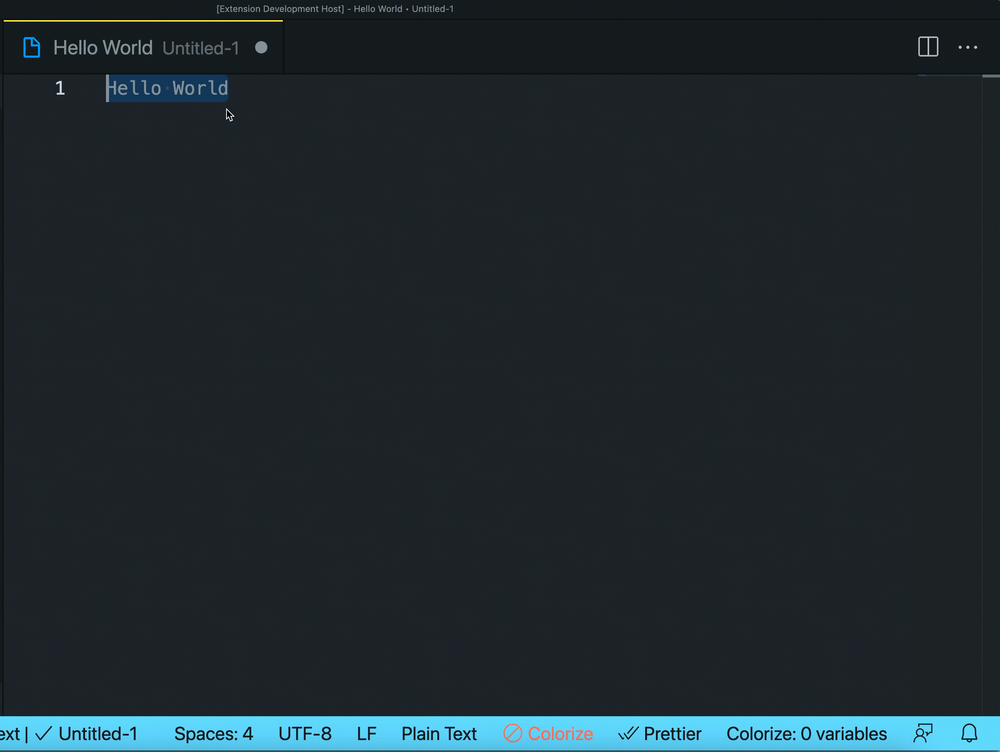
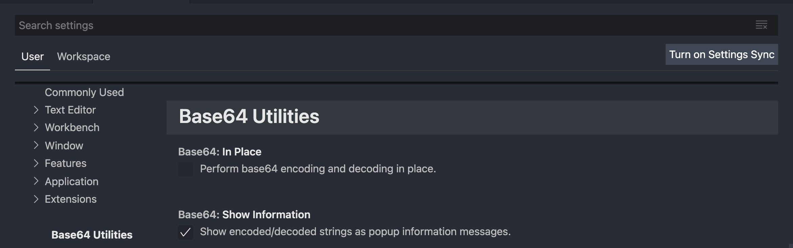

# Base64 Utilities

## Features

Adds right click options that allow you to select text, right-click it, and then either base64 encode or decode it.

## Extension Settings

This extension contributes the following settings:

* `Base64.showInformation`: If this is set to true (checked) the results of the encoding/decoding will show up as an information message. Default value is true.
* `Base64.inPlace`: If this is set to true (checked) the selected text will be replaced by the results of the encoding/decoding. Default value is false.

## Known Issues

## Release Notes

#### 1.0.1

Updated README to show valid images, and refactored right-click menu options.
